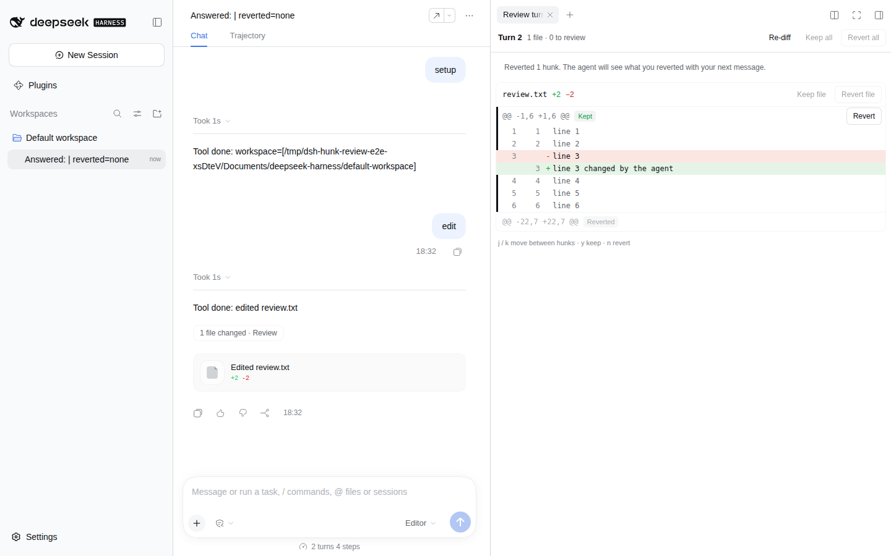

# dsh-hunk-review

Review the file edits the agent made in a [DeepSeek Harness](https://github.com/deepseek-ai/deepseek-harness) (dsh) turn, hunk by hunk, in the Web UI. Keep or revert each hunk, a whole file, or every change of the turn, the way Zed's agent review and VS Code's Copilot Keep / Undo work.



- A **"N files changed · Review"** chip at the end of every turn that changed files opens the review in the right sidebar.
- Each hunk shows its lines and **Keep** / **Revert**. Each file has **Keep file** / **Revert file**, and the header has **Keep all** / **Revert all** and **Re-diff**.
- Keyboard: `j` / `k` move between hunks, `y` keeps, `n` reverts.
- A revert writes the file back through dsh's file service, only if the lines are still what the agent left. If you changed them since, the hunk shows as a conflict with the difference.
- The agent is told what you reverted with your next message, so it does not redo it blindly.

## Contents

- [Install](#install)
- [What you see](#what-you-see)
- [What a revert does](#what-a-revert-does)
- [What the agent sees](#what-the-agent-sees)
- [What gets logged](#what-gets-logged)
- [Configuration](#configuration)
- [Security](#security)
- [Known limitations](#known-limitations)
- [Compatibility](#compatibility)
- [Development](#development)

## Install

```sh
dsh plugin --profile web add dsh-hunk-review
```

From a packed tarball (for example one built from this repository with `pnpm pack`):

```sh
dsh plugin --profile web add /absolute/path/to/dsh-hunk-review-0.1.0.tgz
```

The bundle patch (`cordis.patch.yml`) inserts one plugin row with id `hunk-review`. The Web plugin page (**Plugins** in the sidebar) can do the same. Restart dsh if the profile does not reload live.

## What you see

**The chip.** After a turn in which the agent changed files, a small **"N files changed · Review"** button appears at the end of the turn, above the turn's other cards. It appears only while the server still has the turn's changes (see [Known limitations](#known-limitations)).

**The review tab.** The chip opens a **Review turn N** tab in the right sidebar. It lists every file the turn changed:

- a header with the turn, the number of files and of hunks still to review, **Re-diff**, **Keep all**, and **Revert all**;
- per file: the path, `+added −deleted`, *New file* or *Deleted file* where it applies, **Keep file**, and **Revert file**;
- per hunk: the `@@` range, its status, the lines with old and new line numbers, and its buttons.

A hunk has one of four statuses, read from the file as it is now each time the review loads:

| Status | Meaning | Buttons |
|---|---|---|
| To review | The agent's lines are in the file and you have not decided. | Keep, Revert |
| Kept | The agent's lines are in the file and you kept them. | Revert |
| Reverted | The lines from before the turn are back. | none |
| Changed since the turn | Neither the agent's lines nor the earlier lines are where the hunk expects them. | Re-diff |

**Keep file**, **Revert file**, **Keep all**, and **Revert all** act on the hunks still *to review*; kept hunks stay. **Re-diff** reads the files again and recomputes every status, for example after you edited a file by hand. When the tab becomes visible it re-diffs by itself.

**Keyboard.** Click the tab (or tab into it) and use `j` / `k` to move between hunks, `y` to keep the selected hunk, and `n` to revert it. After `y` or `n` the selection moves to the next hunk.

## What a revert does

The baseline is the state of each file when the turn started. dsh's `workspace-changes` recorder takes it: a git snapshot of the working tree at turn start and turn end, plus a copy of every file a file tool edits. This plugin reads the recorded comparison of each file (hunks with three lines of context) through the recorder's `ctx.workspaceChanges` service.

To revert hunks of one file, the plugin:

1. reads the file and its version through dsh's file service (`ctx.fs`), in the session's working directory;
2. finds each chosen hunk's turn-end lines (context and added lines), searching outward from the line where the hunk expects them. That place moves by the size of earlier hunks of the file that are already reverted;
3. replaces them with the hunk's turn-start lines (context and removed lines), from the bottom of the file up;
4. writes the file back with a version guard (`replaceIfVersion`, or `createIfAbsent` for a file the agent deleted). If anything changed the file between the read and the write, the write fails and the hunk is reported as changed.

Lines outside the chosen hunks stay as they are, including your own edits elsewhere in the file. A hunk whose turn-end lines are not found exactly is never written. It is reported as *changed since the turn*, and the tab shows how the file differs at that place: `-` for the agent's lines, `+` for what is there now.

- **File the agent created.** Reverting all its hunks leaves an empty file. dsh's file service cannot delete files, so the tab says so; delete it yourself if you want it gone.
- **File the agent deleted.** Reverting recreates it with its old content.
- **Machine workspaces.** Reads and writes go through `ctx.fs` with the session's working directory, so a workspace on a paired machine (`/machines/<machine>/…`) is reverted on that machine when the build routes the file service there.
- **While the agent works.** Reverts are refused while the agent is running a turn (it might be editing the same file), unless `revertWhileRunning` is on. Keeping is always allowed.

## What the agent sees

After a revert that changed at least one hunk, the plugin queues one user message with source `{ kind: 'hunk-review', seq, turn, files: [{ path, hunks }] }` through `agent.inject()`. Queued context does not start a turn. The agent reads it at its next request, usually when you send your next message.

```text
The user reviewed the file changes you made in turn 2 and reverted the hunk below. These changes are no longer in the files: each file now has the lines marked "-" where it had the lines marked "+". Do not reapply them unless the user asks; read a file again before editing it.
<reverted_changes>
<file path="src/app.ts">
@@ -22,7 +22,7 @@
 line 22
 line 23
 line 24
-line 25
+line 25 changed by the agent
 line 26
 line 27
 line 28
</file>
</reverted_changes>
```

The hunks are shown as the agent made them, so the agent knows exactly which of its lines are gone. Frame tags inside the lines (`<file`, `</reverted_changes>` and their other forms) are written as `&lt;…`. Hunk lines beyond `messageMaxBytes` (24,000 bytes by default) are replaced by one line such as `[120 more lines of the reverted hunks omitted]`.

Keeping a hunk tells the agent nothing: kept lines are already what it left.

Context cost: one user message per revert action, about the size of the reverted hunks plus about 70 tokens of framing. The plugin adds nothing to the system prompt and registers no tool.

**When the agent may miss a note.** Queued context is held by the agent until its next request. If you press **Stop** on a running turn, or the dsh server restarts before your next message, the queued note is dropped. The file stays reverted.

## What gets logged

The plugin adds no session event types. The note is a `user/message`: it is logged when the agent's inbox queues it (`agent/inbox/spliced`) and again when a request takes it, so everything the model sees can be rebuilt from the session log. Stock dsh shows it as a context row, also after the plugin is removed.

Keep decisions are not logged. They live in the server's memory for the life of the session, like the recorded changes themselves. The files on disk are the record of what was reverted.

## Configuration

All settings are optional. Override them in your profile's `cordis.patch.yml` by targeting the row id:

```yaml
- id: hunk-review
  config:
    maxFiles: 200                 # files reviewed per turn; more are counted but not listed
    maxFileBytes: 2097152         # largest file read for review and revert
    messageMaxBytes: 24000        # bytes of reverted hunk lines in the note to the agent
    revertWhileRunning: false     # allow reverts while the agent is running a turn
```

## Security

- The routes (`/api/hunk-review/summary`, `review`, `keep`, `revert`) are registered only on the authenticated Web connection, so they pass dsh's browser authentication (the launch-token cookie, or Cloudflare Access when configured). Profiles without the Web connection, the file service, or the `workspace-changes` recorder register no routes.
- A revert only writes files the turn's recorded summary lists, only in the lines of the chosen hunks, and only when those lines are still exactly what the agent left. Writes go through `ctx.fs`, so a sandboxing file backend applies its own rules.
- The review serves the recorded hunks and, for a conflict, a few lines of the file as it is now. It serves no other file content.

## Known limitations

- **Live sessions only.** `workspace-changes` keeps a turn's comparison in the server's memory while the session is open there. After a server restart, earlier turns have no chip and no review.
- **One turn at a time.** Each review covers one turn against the start of that turn. To undo work spread over several turns, review each turn.
- **Coverage.** The recorder lists what git snapshots and file-tool captures show: without a git repository, only files a file tool edited; shell edits outside the snapshot are absent (see the `workspace-changes` README).
- **No delete.** Reverting a created file empties it instead of deleting it.
- **Exact lines only.** A hunk is found only where all of its lines match exactly; whitespace changes count as changes. Line endings follow dsh's file service, which reads text with LF line endings.
- **Ambiguous places.** When the same lines occur more than once, the occurrence nearest to the hunk's expected line is used.
- **Keep is not durable.** Kept marks are lost when the server restarts.

## Compatibility

- dsh `>=0.1.7-rc.1 <0.2` with the Web profile, the `@deepseek-ai/dsh-workspace-changes` recorder (part of the Web bundle), and a file service (`ctx.fs`).
- The tab uses the right sidebar's tab registry (`ctx.sidebarRightTabs`); the chip uses the chat's `conversation.chat.turnTail` slot. The page-command seam (`bindCommands`, for the sidebar's refresh control) is used when the host has it.
- Node.js `^22.19 || >=24`. The browser half targets the dsh Web client (`dsh.client.platform: web`).

## Development

```sh
pnpm install
pnpm --filter dsh-hunk-review run typecheck
pnpm --filter dsh-hunk-review test
pnpm --filter dsh-hunk-review run build
pnpm --filter dsh-hunk-review run pack:tarball   # writes .artifacts/dsh-hunk-review-<version>.tgz
```

The unit tests cover:

- hunk sides, text splitting, placement (pending, reverted, conflict), the reverse patch, and conflict drift;
- the note's framing, escaping, and truncation, and target selection;
- the routes inside the published dsh agent loop with the real `workspace-changes` recorder over git and the local file service: review, keep, revert, conflicts, the refusal while the agent runs, and the note in the next model request and the session log;
- the Loader composition, including the absence of routes without the recorder;
- the review panel, keyboard handling, the browser store, the Turn data, and the dictionaries.

The browser test (`e2e/`) installs the packed plugin and a test-only model route into a throwaway `DSH_HOME` with `dsh plugin add`, boots the `web` profile, and drives Chromium through: a turn that edits a file in a git workspace, the chip, the tab, `j` / `y` / `n`, the file on disk, a conflict after an outside edit and **Re-diff**, and the note reaching the model with the next message.

```sh
DSH_E2E_CHECKOUT=/path/to/deepseek-harness pnpm --filter dsh-hunk-review run test:e2e
```

Without `DSH_E2E_CHECKOUT` (or `DSH_E2E_BIN`) the browser test is skipped. `DSH_E2E_KEEP_HOME=1` keeps the throwaway `DSH_HOME`, and `DSH_E2E_SCREENSHOT=<path>` saves a screenshot of the review. It needs Playwright's Chromium (`pnpm exec playwright install chromium`).

## License

MIT
