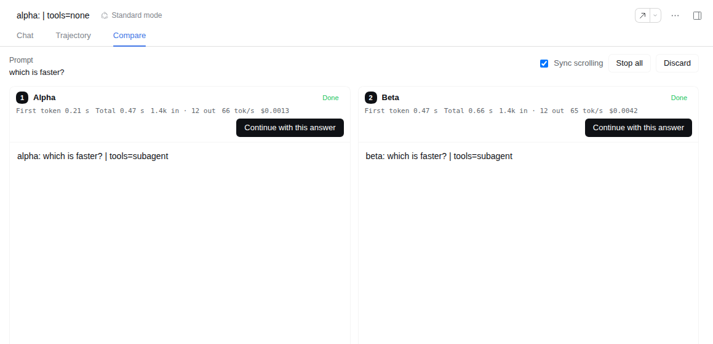
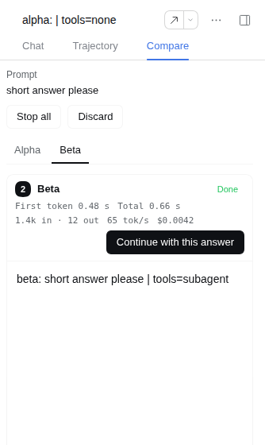

# dsh-model-compare

Side-by-side model comparison for the [DeepSeek Harness](https://github.com/deepseek-ai/deepseek-harness) (dsh) Web UI. Send one prompt to 2–4 models from the session you are in, watch the answers stream in columns with their latency, time to first token, tokens, and cost, then continue the conversation with the answer you pick.



## Contents

- [Install](#install)
- [What you see](#what-you-see)
- [How it works](#how-it-works)
- [Tools during a comparison](#tools-during-a-comparison)
- [Cost](#cost)
- [Configuration](#configuration)
- [What gets logged](#what-gets-logged)
- [Uninstalling](#uninstalling)
- [Known limitations](#known-limitations)
- [Compatibility](#compatibility)
- [Development](#development)

## Install

```sh
dsh plugin --profile web add dsh-model-compare
```

From a packed tarball (for example one built from this repository with `pnpm pack`):

```sh
dsh plugin --profile web add /absolute/path/to/dsh-model-compare-0.2.0.tgz
```

The bundle patch (`cordis.patch.yml`) inserts one plugin row with id `model-compare`. The Web plugin page (**Plugins** in the sidebar) can do the same. Restart dsh if the profile does not reload live.

## What you see

**A Compare tab** next to Chat (and Trajectory) in every session header, once the session has its first message.

**Setup.** Pick the models: the default model is preselected. How you add the others depends on whether [`dsh-model-switcher`](../dsh-model-switcher/README.md) is installed:

- **With `dsh-model-switcher` 0.2 or later**: **Add models** opens the switcher's popover (the provider select, fuzzy model search, favorites, recents, badges, and keyboard of the composer picker; a bottom sheet on phones) in a mode that checks several models and confirms with **Done**. It lists only models not yet chosen and stops at the model limit. Click a chosen model's name to swap it for another. Picking here does not change the session's model.
- **Without it**: a search box lists the catalog, with the switcher's favorites and recent models first when an older switcher has stored them.

Models with a reasoning-effort control get an effort menu on their chip, either way. Type the prompt and press **Compare** (or Ctrl/Cmd+Enter). The form says how many models will be billed, the answer-length cap, and whether the models get tools.

**Columns.** One column per model, numbered, each with:

- the model name and a status: Waiting, Answering…, Done, Failed, Stopped, or Cut off (hit the output cap);
- the numbers, as soon as they exist: time to first token, total time, input and output tokens, reasoning tokens, output speed (tok/s), and the provider-reported cost;
- the answer, streaming, rendered as Markdown, with reasoning in a collapsible block and one row per tool call;
- **Stop** while the model answers, **Continue with this answer** once it has finished.

Above the columns: the prompt, **Sync scrolling** (keeps the columns at the same relative position; on by default), **Stop all**, and **Discard**.

**On a phone** (720 px wide or less) the columns become one full-width page each: swipe between them or use the tab row with the model names.



**Continue with this answer** makes that answer part of the conversation. The plugin forks the chosen column into a new session that holds the whole history, the prompt, and that answer, opens it, and archives the columns and the original session. You keep talking to the chosen model, with its full tools. The new session keeps the original title.

**Discard** stops and archives the columns and leaves the original session as it was.

The comparison survives a reload or a Host restart: reopening the Compare tab shows the open comparison.

## How it works

Each column is a *lane*: an ordinary dsh session forked from yours at its latest completed turn, running one model on the same prompt. Your session itself receives nothing. Lanes live in the same workspace and appear in the sidebar (titled `<model> — <session title>`) while the comparison is open; closing the comparison archives them. Archived sessions stay readable and can be unarchived.

Continuing uses dsh's standard session fork, so the conversation continues in an ordinary session composed like any other (same persona, full tools), on the chosen model.

Maintainer notes, the seams used, and the research behind the UX: [docs/design.md](docs/design.md).

## Tools during a comparison

Lanes share one workspace, so letting several agents edit it at once would race. By default a lane gets **no tools**: the model answers from the conversation alone. Two layers enforce it on each lane:

- the lane's tool list is restricted, so the model is not offered the tools;
- a guard denies every tool call after all other tool policies, so a call the model makes anyway fails with "Tools are turned off in model comparison lanes".

The policy is applied before a lane's first request and again whenever a lane's agent is created (after a Host restart, or when you open a lane from the sidebar). If it cannot be applied, the lane does not start.

`tools: read-only` keeps a list of tools that only read (`read`, `read_image`, `grep`, `glob` by default). `tools: all` gives lanes every tool; the setup form then warns that several models may change the workspace at the same time.

Tools that another plugin registers directly on each agent (in some Web profiles, `subagent`) stay in the lane's tool list, because dsh's tool restriction only covers tools an agent inherits. The guard still denies every call to them.

Continuing with an answer creates an ordinary session, so the conversation gets its normal tools back.

## Cost

Every column is a separate model request with the whole conversation as input, billed separately. To keep that bounded:

- at most 4 models per comparison (`maxModels`, 2–4);
- answers capped at 8192 output tokens per request (`maxOutputTokens`, 0 to use the model's default);
- no tools by default, so a lane is one request unless the provider retries;
- lanes get fixed titles, so dsh makes no title-generation request for them;
- the setup form states how many models will be billed.

The cost in each column is what the provider reported (for example OpenRouter's `usage.cost`). dsh has no price table, so nothing is estimated; providers that do not report cost show "cost not reported".

## Configuration

All settings are optional. Override them in your profile's `cordis.patch.yml` by targeting the row id:

```yaml
- id: model-compare
  config:
    maxModels: 4               # most models per comparison, 2–4
    tools: none                # none | read-only | all
    readOnlyTools:             # kept by read-only when they exist
      - read
      - read_image
      - grep
      - glob
    maxOutputTokens: 8192      # output cap per lane request; 0 = model default
    maxPromptChars: 32000      # longest prompt accepted
    archiveSourceOnAdopt: true # archive the original session after Continue
```

## What gets logged

The plugin adds no session event types. Everything is ordinary dsh history:

- each lane is a forked session (`parentSession` is your session) whose own events start with the prompt as a `user/message`, followed by the model's answer;
- the lane title is a `session/title` rename;
- continuing is a standard fork of the lane.

Comparison records (the prompt, the lanes, and whether a lane was adopted or the comparison discarded) are kept in the storage domain `model_compare` under the dsh home (`storages/model_compare`). The lane statistics come from the session projection `model-compare`, derived from each lane's own events.

## Uninstalling

Every session stays readable. Lanes of open comparisons become ordinary sessions without the tool restriction; lanes of closed comparisons are archived. The `model_compare` storage directory can be deleted.

## Known limitations

- The Compare tab appears only once the session has its first message (dsh hides session views on a blank session).
- Columns show a compact transcript (answers, reasoning, tool calls, errors) rather than the full Chat view, which dsh does not allow inside another session view. Open a lane from the sidebar to see its full Chat.
- One open comparison per session; a comparison cannot start from a lane.
- Lanes are visible in the sidebar while the comparison is open.
- dsh has no session delete, so closed lanes are archived rather than deleted.

## Compatibility

- dsh `>=0.1.7-rc.1 <0.2`, Web profile. The routes and the tab exist only with the Web connection; other profiles register nothing.
- Needs the session controller (`resolveAgent`, `fork`, `modelCatalog`), the workspace registry, and the storage domain, all in the stock Web profile.
- `dsh-model-switcher` is optional. The setup form uses its `modelSwitcher` picker service (0.2 or later) when the page provides it, and its own list otherwise. There is no package dependency: the service is found at run time.
- Node.js `^22.19 || >=24`.

## Development

```sh
pnpm install
pnpm --filter dsh-model-compare run typecheck
pnpm --filter dsh-model-compare test
pnpm --filter dsh-model-compare run build
pnpm --filter dsh-model-compare run pack:tarball   # writes .artifacts/dsh-model-compare-<version>.tgz
```

The unit tests run the plugin in the published dsh agent loop with a scripted model and the real storage stack. They cover:

- lane creation (history, model, effort, output cap), the prompt, and a source that stays untouched;
- the statistics fold and projection;
- the tool policy in all three modes, including a denied write, and its re-application to a resumed lane and after a restart;
- adopt, stop, discard, and request validation;
- Loader composition with and without the Web connection;
- the browser view: setup with the built-in list and with the switcher's picker (multiple pick, cancel, swap, excluded models, efforts kept per model), columns, lane status and numbers, the transcript fold, and the switcher preferences;
- finding the switcher's `modelSwitcher` service on a real Cordis context, with and without it.

The browser test (`e2e/`) installs the packed plugin and a test-only model route (`e2e/alpha`, `e2e/beta`) into a throwaway `DSH_HOME`, boots the `web` profile, and drives Chromium through a two-model comparison with statistics, continuing with one answer (which then runs on that model with its tools), a lane that tries to write a file (and cannot), the built-in model list, and the phone layout with tabs. A second server also installs the packed `dsh-model-switcher` (the script builds and packs it too) and picks two models in its popover before comparing them:

```sh
# @deepseek-ai/dsh from npm, at the version of the pinned @deepseek-ai/dsh-* dev dependencies
pnpm --filter dsh-model-compare run test:e2e
# another npm version, a built dsh checkout, or any other launcher
DSH_E2E_VERSION=0.1.7-rc.2 pnpm --filter dsh-model-compare run test:e2e
DSH_E2E_CHECKOUT=/path/to/deepseek-harness pnpm --filter dsh-model-compare run test:e2e
DSH_E2E_BIN="npx -y @deepseek-ai/dsh@next" pnpm --filter dsh-model-compare run test:e2e
```

`DSH_E2E_KEEP_HOME=1` keeps the throwaway `DSH_HOME`; `DSH_E2E_SCREENSHOTS=<dir>` saves screenshots. It needs Playwright's Chromium (`pnpm exec playwright install chromium`).

## License

MIT
