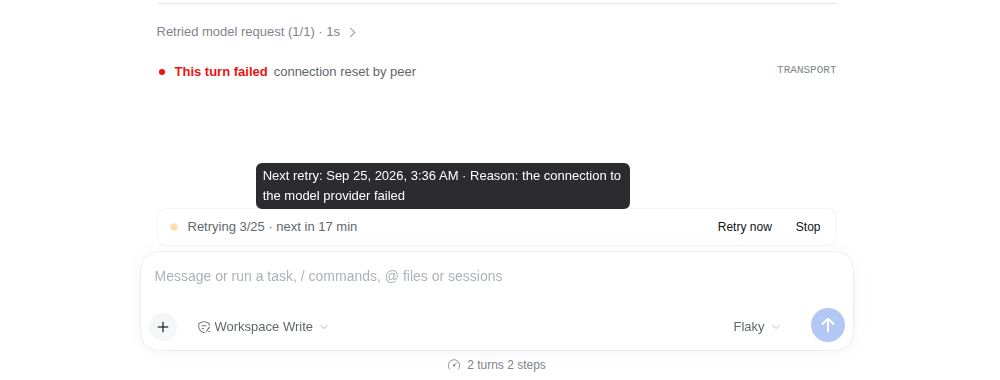

# dsh-session-retry

Automatic session retries for [DeepSeek Harness](https://github.com/deepseek-ai/deepseek-harness) (dsh).

When a turn fails on a transient problem (the model provider stalls, the network drops, the provider answers 5xx or rate-limits you after dsh's own per-request retries are used up), the turn ends normally and the session goes into a quiet *retrying* state instead of sitting in "running". Later the plugin continues the session by itself with one short note, using a backoff that starts at one second and stretches to days. It stops as soon as the session succeeds, you write something, you press **Stop**, or the attempt budget runs out.



## Contents

- [Install](#install)
- [What you see](#what-you-see)
- [How it decides what is retryable](#how-it-decides-what-is-retryable)
- [Backoff policy](#backoff-policy)
- [Configuration](#configuration)
- [Adding your own retry conditions](#adding-your-own-retry-conditions)
- [What gets logged, and context cost](#what-gets-logged-and-context-cost)
- [Uninstalling](#uninstalling)
- [Compatibility](#compatibility)
- [Development](#development)

## Install

```sh
dsh plugin --profile web add dsh-session-retry
```

From a packed tarball (for example one built from this repository with `pnpm pack`):

```sh
dsh plugin --profile web add /absolute/path/to/dsh-session-retry-0.2.0.tgz
```

The command adds the package to the profile and selects its bundle; the bundle patch (`cordis.patch.yml`) inserts one plugin row with id `session-retry`. The Web plugin page (**Plugins** in the sidebar) can do the same. Restart dsh if the profile does not reload live.

The plugin needs the standard session services (`agents`, `sessions`, `sessionProjections`), which every dsh profile has. The **Retry now** / **Stop** buttons and the `/retry` command need the command registry, which the Web profile has; without it retries still run, you just cannot trigger or stop them by hand.

## What you see

A calm block at the end of the transcript, directly above the composer:

- **Retrying 13/25 · next in 2 h**: the attempt that runs next, the budget, and a countdown that ticks live. Hover it for the exact local date and time of the next retry and the reason.
- **Retrying 14/25 · waiting: the payments API was unreachable · next in 3 h**: a slot came due but the failing dependency reported it was not ready, so the model was not called (see [readiness](#readiness-preflight-and-ready-signals)).
- **Gave up after 25 attempts**: the budget is spent. **Retry now** still works.

A small dot pulses slowly next to the text, dimmed, so the session looks alive but paused. With *reduce motion* enabled in the OS the dot stays still.

**Retry now** runs the pending attempt immediately. **Stop** cancels retrying for this failure. Both are the `/retry now` and `/retry stop` commands, which you can also type into the composer.

Writing any new message cancels the pending retry: your message supersedes it.

## How it decides what is retryable

After every turn the plugin collects plain facts about it from the session log (the `RetryFailure` below) and asks the registered *retry conditions* in order. The first one that matches decides the reason; if none matches, nothing is retried. Failures that are not transient (authentication, invalid requests, a turn you cancelled) match nothing and are never retried.

Built-in conditions, each switchable in the configuration:

| Condition id | Matches `turn/end` errors with | Default codes | Default HTTP statuses |
|---|---|---|---|
| `builtin:provider-stall` | a provider stream that stopped sending data, or a request timeout | `LLM_STREAM_IDLE_TIMEOUT`, `TIMEOUT` | 408, 504 |
| `builtin:transport` | a network or connection failure | `TRANSPORT`, `STREAM_CLOSED` | none |
| `builtin:server-error` | a provider server error | `SERVER` | 500, 502, 503, 520–524, 529 |
| `builtin:rate-limit` | a provider rate limit | `RATE_LIMIT` | 429 |

These only see failures that end the turn, which happens after dsh's `llm-retry` has used up its own quick per-request retries. The two layers do not overlap: `llm-retry` retries one request for seconds; this plugin retries the whole session for up to weeks. A provider whose retry policy uses `mode: always` never ends the turn on these errors, so this plugin never sees them; use `mode: normal` with a small `maxRetries` for such providers.

## Backoff policy

After failed attempt *n*, the next attempt waits *n*⁴ seconds with a random jitter of ±10%: 1 s, 16 s, 81 s, 4 min 16 s, 10 min, 22 min, 40 min, 68 min, … 3 days 20 hours after attempt 24. The original turn is attempt 1, so the default budget of 25 attempts spends about 20.4 days waiting before the last attempt runs, and the block gives up one more backoff (about 4.5 days) after that last slot if it never ran.

The jitter for each slot is derived from the session id, the failing turn's log position, and the attempt number. That makes the schedule reproducible from the log alone: after a restart, a backup restore, or on another machine, every slot lands at the same time.

If a scheduled attempt fails too, the next wait is computed from that failure (*n*⁴ for the attempt that just failed).

### After a restart

Retries do not depend on anyone having the session open. When dsh starts (every deploy restarts it), the plugin waits `resumeDelaySeconds`, looks for stored sessions whose retry is still waiting, and opens each one the same way the Web UI does when you click it. The most recent missed slot then runs once; older missed slots count as used. A retry chain therefore keeps going by itself for its whole budget (about 25 days by default), across any number of restarts.

What the start-up sweep does and does not touch:

- It reads the `session-retry` value that dsh's projection cache already stores for every session, so it does not read session logs. A deployment without the projection cache (every stock profile has it) falls back to reading each log.
- It only opens sessions whose retry is waiting and whose failure is inside the budget's horizon (every backoff at its largest jitter: about 27 days with the defaults). Stopped, cancelled, exhausted, finished, archived, and subagent sessions stay closed.
- It opens sessions through the Web profile's session controller, so a session gets exactly the composition (preset, model selection, tools) it would get if you opened it. Profiles without that controller (for example headless) skip the sweep and log that once; their retries run while a session is loaded.
- It opens at most `resumeConcurrency` sessions at a time, and logs one summary line such as `session-retry: start-up sweep resumed 2 of 2 sessions with a waiting retry (41 stored, 0 failed, 12 ms)`. The line carries counts only, never prompts or tool results.
- A session it opens stays loaded, as if you had opened it.

## Configuration

All settings are optional. Override them in your profile's `cordis.patch.yml` by targeting the row id:

```yaml
- id: session-retry
  config:
    maxAttempts: 25              # attempts including the original turn
    backoff:
      exponent: 4                # wait after attempt n is n^exponent seconds
      jitterRatio: 0.1           # ± fraction of the wait
    readySignals: true           # let conditions run a pending attempt early
    resumeOnStart: true          # open sessions with a waiting retry when dsh starts
    resumeConcurrency: 4         # sessions the start-up sweep opens at the same time
    resumeDelaySeconds: 5        # wait after start so other plugins can register their conditions
    continuation: '(Automatic retry {attempt}/{maxAttempts}: {reason}. Continue the previous request.)'
    builtins:
      rate-limit:
        enabled: false           # turn a built-in off
      server-error:
        statuses: [500, 502, 503]
```

`continuation` is the text the model receives; `{attempt}`, `{maxAttempts}`, and `{reason}` are filled in.

Conditions another plugin registers later than `resumeDelaySeconds` after start are not seen by the start-up sweep; a session waiting on such a condition resumes when it is opened.

## Adding your own retry conditions

Another plugin can teach the retry plugin about its own transient failures through the `sessionRetry` service. A condition classifies a failure, gives the human reason, and can optionally say when its dependency is back.

```ts
import type { Context } from '@deepseek-ai/cordis'
import type {} from 'dsh-session-retry'

export const name = 'payments-retry'
export const inject = ['sessionRetry']

export function apply(ctx: Context) {
  // Removed automatically when this plugin unloads; the returned function removes it earlier.
  ctx.sessionRetry.registerCondition({
    id: 'payments:api-unreachable',
    matches(failure) {
      const last = failure.toolResults.filter(result => result.toolName === 'charge_card').at(-1)
      return last?.isError && last.errorText?.includes('Payments API is unreachable')
        ? { reason: 'the payments API was unreachable' }
        : undefined
    },
    // Optional: asked when a slot comes due. false skips the slot without calling the model.
    isReady: async () => (await fetch('https://payments.example.com/health')).ok,
    // Optional: call signal() when the API is back to run the pending attempt immediately.
    ready(ref, signal) {
      const timer = setInterval(async () => {
        if ((await fetch('https://payments.example.com/health')).ok) signal()
      }, 30_000)
      return () => clearInterval(timer)
    },
  })
}
```

### The contract

`RetryFailure` holds the facts of the most recent finished turn, all read from standard session events:

| Field | Meaning |
|---|---|
| `sessionId`, `turn` | Session and turn number. |
| `end` | How the turn ended: `completed`, `max-tokens`, `blocked`, `aborted` (with `cause`), `error` (with `error.code`, `error.message`, optional `error.status`), or `other` (a newer dsh turn-end kind, with `name`). |
| `toolResults` | Tool results of the turn in order (last 50): `toolName`, `isError`, and for errors `errorText` (model-facing text, up to 2,000 characters), `errorName`, `errorCode`, `errorReason`. |
| `llmRetries` | Per-request retries `llm-retry` recorded in the turn (last 20): `provider`, `code`, `message`, `status`. |
| `provider`, `model` | Route of the turn's last model request. |

A tool failure does not end a turn by itself: the model sees the error and usually answers. A condition that matches tool failures therefore sees turns that ended `completed`; check the *last* result of the relevant tool so a failure the model already recovered from is not retried.

`RetryCondition`:

| Member | Meaning |
|---|---|
| `id` | Unique, stable id (lowercase letters, digits, `-`, `.`, `:`, `/`). Logged with every retry it causes. |
| `priority` | Higher runs first; equal priorities keep registration order. Default 0 (the built-ins use 0). The first match wins. |
| `matches(failure)` | Return `{ reason }` to make the failure retryable, or `undefined`. Must be pure: it runs whenever the block's state is computed and before every retry. A throw is logged and treated as no match. |
| `isReady(ref)` | Optional readiness preflight, asked when a slot comes due. |
| `ready(ref, signal)` | Optional subscription held while a retry this condition matched is pending; returns its disposer. |

`registerCondition(condition)` returns a disposer and is scoped to the calling plugin. `conditions()` lists the registry in evaluation order, `view(sessionId)` returns the value the chat block shows, and `retryNow(sessionId)` runs the pending attempt.

### Readiness preflight and ready signals

When a slot comes due, the plugin asks the matching condition's `isReady`. If it answers `false` (or throws), the plugin does **not** call the model and does **not** write anything to the session. The slot still counts as an attempt, and the next slot is scheduled as usual. The block shows "waiting: *reason*" meanwhile. Skipped slots are derived from the clock: the attempt number at any time is simply the number of slots that have passed since the failure.

When a condition's `ready` calls `signal()`, the pending attempt runs at once (or, if the last slot was skipped, that attempt runs now). The backoff schedule stays the fallback, and `readySignals: false` turns this shortcut off.

## What gets logged, and context cost

The plugin adds no event types of its own. Everything it knows is folded from events dsh always writes (`turn/end`, `user/message`, `tool/result`, `llm/retry`, `request/context`, `command/run`, `command/done`) plus the current time.

A retry that calls the model appends one ordinary `user/message`, for example:

> (Automatic retry 3/25: the connection to the model provider failed. Continue the previous request.)

with the source `{ kind: 'session-retry', attempt, maxAttempts, conditionId, reason, trigger }` (`trigger` is `schedule`, `ready`, or `manual`). That message is the model-visible record of the retry, so the conversation stays reconstructable from the log.

Context cost: one short message (about 20 tokens) per retry that calls the model, plus whatever the continued turn produces. A skipped slot costs nothing.

In the Web transcript the continuation appears as a small collapsed row, like other messages a plugin adds on your behalf.

## Uninstalling

Remove the plugin with `dsh plugin --profile web remove dsh-session-retry` (or on the Plugins page). Sessions stay readable: the only trace in the log is ordinary `user/message` events whose source kind (`session-retry`) stock dsh keeps as an unknown producer. Pending retries simply stop; nothing needs cleaning up.

## Compatibility

- dsh `>=0.1.7-rc.1 <0.2`: peer dependencies on `@deepseek-ai/dsh-*` packages use `^0.1.7-rc.1`.
- Node.js `^22.19 || >=24`.
- The browser half targets the dsh Web client (`dsh.client.platform: web`).

## Development

```sh
pnpm install
pnpm --filter dsh-session-retry run typecheck
pnpm --filter dsh-session-retry test
pnpm --filter dsh-session-retry run build
pnpm --filter dsh-session-retry run pack:tarball   # writes .artifacts/dsh-session-retry-<version>.tgz
```

The tests run the plugin inside the published dsh agent loop with a scripted model: backoff math, classification, restart from a stored log, the start-up sweep over a JSONL store and the projection cache, uninstall safety, a person's message cancelling, exhaustion, third-party conditions with readiness, the Loader composition, and the browser block.

The browser test (`e2e/`) installs the packed plugin and a test-only model route into a throwaway `DSH_HOME` with `dsh plugin add`, boots the `web` profile, and drives Chromium through the block, its tooltip, **Retry now**, **Stop**, and cancellation by a new message. It then closes the browser, restarts the server, and checks in the stored log that the waiting retry ran without the session being opened.

```sh
# @deepseek-ai/dsh from npm, at the version of the pinned @deepseek-ai/dsh-* dev dependencies
pnpm --filter dsh-session-retry run test:e2e
# another npm version, a built dsh checkout, or any other launcher
DSH_E2E_VERSION=0.1.7-rc.2 pnpm --filter dsh-session-retry run test:e2e
DSH_E2E_CHECKOUT=/path/to/deepseek-harness pnpm --filter dsh-session-retry run test:e2e
DSH_E2E_BIN="npx -y @deepseek-ai/dsh@next" pnpm --filter dsh-session-retry run test:e2e
```

`DSH_E2E_KEEP_HOME=1` keeps the throwaway `DSH_HOME` for inspection. It needs Playwright's Chromium (`pnpm exec playwright install chromium`).

## License

MIT
